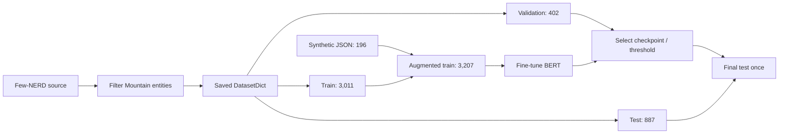
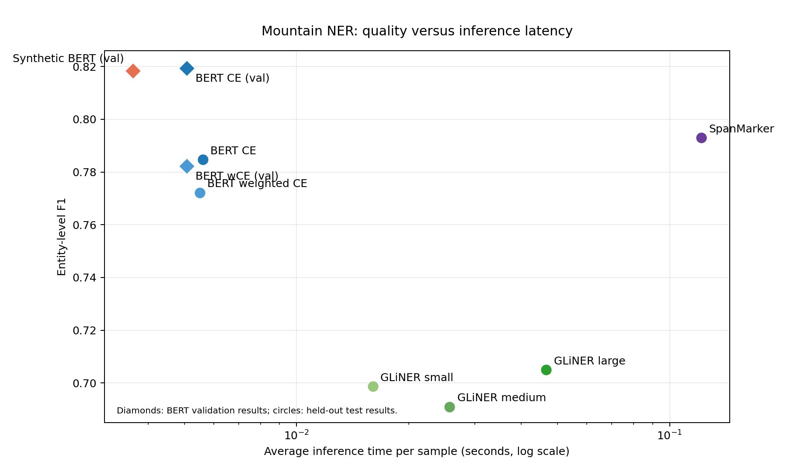

# Mountain NER

This task identifies mountain names in text. The solution includes Few-NERD data preparation, synthetic training augmentation, two supervised BERT loss variants, GLiNER and SpanMarker baselines, a deterministic catalog matcher, full-split evaluation, and single-sentence inference.

## Repository setup:

### 1) Clone this repository:
```angular2html
git clone https://github.com/bhdn-BB/summer_homework_2026.git
cd summer_homework_2026/src/ner
```
### 2) Create and activate a virtual environment:
```angular2html
python -m venv .venv
.venv\Scripts\activate
```
### 3) Install the required dependencies:
```angular2html
pip install -r requirements.txt
```
---

## LLM extraction via Groq Cloud

`evaluation/llm_benchmark.py` is an asynchronous Groq Cloud API baseline for extracting a mountain from one or more short sentences. Requests are sent concurrently (`--workers`, default `2`) rather than sequentially. In the recorded manual run, a request with a completion cap of 100 tokens took about **0.6 s on average**; network latency and the selected model can change this result.

The default model is `qwen/qwen3.6-27b`. Pass any model ID enabled in the Groq project through `--model-name`, for example a Qwen model, a Llama model, or OpenAI's open-weight GPT-OSS model. The live list is account-dependent and can be obtained from the [Groq models endpoint](https://console.groq.com/docs/models). This script uses `GROQ_API_KEY` and does not store credentials in the repository. Copy `.env.example` to `.env` and populate only the services that you use; `.env` is ignored by Git.

```bash
set GROQ_API_KEY=your_key
python src/ner/evaluation/llm_benchmark.py \
  --text "The expedition climbed K2 during the winter ascent." \
  --text "Skiing down Elbrus was dangerous." \
  --workers 4 \
  --model-name qwen/qwen3.6-27b
```

## Data

`src/ner/data/few_nerd_mountains_output` is a Hugging Face `DatasetDict` with `train`, `validation`, and `test` splits. Every row contains `sentence`, word-level `tokens`, and BIO `labels` (`0=O`, `1=B-Mountain`, `2=I-Mountain`). `src/ner/data/synthetic_processed.json` contains additional training examples and is appended only to the train split in the synthetic notebook.

The canonical data notebook is `notebooks/dataset_creation.ipynb`. It documents the source dataset, filtering, label conversion, and saved-dataset schema.

### Synthetic data provenance

The 196-record `data/synthetic_processed.json` file comes from the [`dataset/synthetic` directory of NERofMountains](https://github.com/te1ord/NERofMountains/tree/main/dataset/synthetic). That source directory also retains `Mountain.csv` and `mountains_only_synthetic.txt`, which document the source mountain-name catalog and generated sentence material. The local notebook does **not** regenerate examples: it validates the provided JSON schema and combines it with the original Few-NERD training split. This keeps the augmentation experiment reproducible and prevents synthetic examples from entering validation or test.

## Dataset split and validation protocol

The base Few-NERD mountain subset is saved once and never re-sampled during training. Synthetic records are appended to the training split only; validation and test remain untouched.

| Split | Base Few-NERD | Synthetic records | Synthetic experiment | Purpose |
| --- | ---: | ---: | ---: | --- |
| Train | 3,011 | 196 | 3,207 | Fit BERT parameters and optional augmentation |
| Validation | 402 | 0 | 402 | Checkpoint selection, loss comparison, threshold selection |
| Test | 887 | 0 | 887 | One final entity-level comparison |



The historical GLiNER table below used `train` for threshold tuning and `test` for evaluation. It does not use test labels during threshold selection, but a fresh final run should use `validation` instead. SpanMarker uses `validation -> test`; supervised BERT uses `train -> validation -> test`.

## Models and metrics

- Fine-tuned BERT uses token-level BIO classification and cross-entropy or weighted cross-entropy.
- GLiNER and SpanMarker are span-based baselines; their confidence threshold is tuned on a non-test split.
- The catalog matcher is a deterministic exact-normalized baseline; it is evaluated only against names covered by the supplied catalogs and should not be treated as a learned NER model.

Use entity-level precision, recall, and F1 as the primary metrics. Token accuracy is secondary because the majority of tokens are `O`. Record inference time over the same split and report average time per example. Thresholds are selected on validation/tuning data and then frozen for test evaluation.

| Component | Fit / tune split | Final evaluation split | Selection rule |
| --- | --- | --- | --- |
| BERT CE and weighted CE | Train + validation | Test | Highest validation F1 checkpoint |
| Synthetic BERT | Augmented train + validation | Test | Highest validation F1 checkpoint |
| SpanMarker | Validation | Test | Confidence threshold maximizing validation F1 |
| GLiNER | Validation recommended | Test | Confidence threshold maximizing validation F1 |
| Catalog matcher | None | Test | Fixed normalization and fuzzy threshold |

## Training

The canonical baseline notebook is `notebooks/bert_baselines.ipynb`. It contains exactly two supervised BERT runs: `cross_entropy` and `weighted_cross_entropy`. Both use a simple `bert-base-cased` `BertForTokenClassification` head over BIO labels, rather than an additional domain-pretraining stage. The synthetic experiment is isolated in `notebooks/bert_synthetic_finetuning.ipynb` and combines the original train split with the externally sourced `synthetic_processed.json` while preserving validation and test.

Direct training command:

```bash
python src/ner/fine_tuning/train_bert.py \
  --data-path src/ner/data/few_nerd_mountains_output \
  --model-name bert-base-cased \
  --loss-name cross_entropy \
  --learning-rate 2e-5 \
  --num-epochs 10 \
  --train-batch-size 32 \
  --max-length 128 \
  --output-dir outputs/bert_ce \
  --save-model-path outputs/bert_ce/checkpoint \
  --device auto \
  --disable-wandb
```

Use separate output directories for CE, weighted CE, and synthetic runs. The saved checkpoint must contain `config.json`, model weights, and tokenizer files.

Install the single pinned environment with `python -m pip install -r src/ner/requirements.txt`.

### Validation-selected BERT checkpoints

The following values are recorded on the 402-example validation split and are used only for checkpoint selection. They are separate from the held-out test benchmark.

| Model | Validation F1 | Accuracy | Precision | Recall | Average time/example |
| --- | ---: | ---: | ---: | ---: | ---: |
| BERT CE | **0.8193** | 0.9828 | 0.8571 | 0.7847 | 0.0051 s |
| BERT weighted CE | 0.7822 | 0.9811 | 0.7966 | 0.7684 | 0.0051 s |
| Synthetic base BERT | 0.8184 | 0.9841 | 0.8353 | 0.8023 | **0.0036 s** |

## Evaluation and inference

Full-split baselines:

```bash
python src/ner/evaluation/gliner_benchmark.py --help
python src/ner/evaluation/span_marker_benchmark.py --help
python src/ner/fine_tuning/bert_experiments.py --model-path outputs/bert_ce/checkpoint --data-path src/ner/data/few_nerd_mountains_output --evaluation-split test --device auto --disable-wandb
```

Single-sentence entrypoints:

```bash
python src/ner/inference/gliner_run.py "The expedition climbed K2 during winter." --threshold 0.50
python src/ner/inference/bert_run.py "The expedition climbed Mount Everest during winter." --checkpoint outputs/bert_ce/checkpoint --threshold 0.50
python src/ner/inference/matcher_run.py "The expedition climbed K2 and Mount Everest." --catalog src/ner/data/catalogs/Mountain.csv --catalog src/ner/data/catalogs/open_peaks_names.csv
```

The inference demo is `notebooks/ner_script_demo.ipynb`; it runs GLiNER, the selected BERT checkpoint, the catalog matcher, and optionally the Groq LLM on one sentence.

## Catalog name matching

The reusable matcher is implemented in `name_matching/match_names.py`. It combines all supplied catalogs as a set, normalizes case, punctuation, Unicode variants, and whitespace, and supports exact matching with optional fuzzy fallback.

Run it on a directory of test sentences:

```bash
python src/ner/name_matching/match_names.py \
  --input-dir src/ner/data/few_nerd_mountains_output/test \
  --catalog src/ner/data/catalogs/Mountain.csv \
  --catalog src/ner/data/catalogs/open_peaks_names.csv \
  --output outputs/mountain_matches.csv \
  --fuzzy-threshold 0.90
```

Evaluate the deterministic baseline on the Few-NERD test split:

```bash
python src/ner/name_matching/evaluate_matcher.py \
  --data-path src/ner/data/few_nerd_mountains_output/test \
  --catalog src/ner/data/catalogs/Mountain.csv \
  --catalog src/ner/data/catalogs/open_peaks_names.csv \
  --output src/ner/data/results/name_matching/few_nerd_test_metrics.json
```

The matcher is a gazetteer baseline, not a learned NER model. Its recall is limited to mountain names present in the catalogs.

## Recorded results

The principal baselines and the catalog matcher were evaluated on the same 887-example Few-NERD mountain test split. The synthetic BERT row is the separately recorded validation result from its 402-example validation split. Thresholds were selected before test evaluation: GLiNER on train, SpanMarker on validation, and BERT by validation checkpoint selection.

| Model | Test F1 | Accuracy | Precision | Recall | Average time/example |
| --- | ---: | ---: | ---: | ---: | ---: |
| SpanMarker RoBERTa-large | 0.7930 | 0.9818 | 0.8702 | 0.7283 | 0.1216 s |
| BERT CE | 0.7847 | 0.9842 | 0.7853 | 0.7841 | 0.0056 s |
| BERT weighted CE | 0.7722 | 0.9836 | 0.7473 | 0.7988 | 0.0055 s |
| GLiNER large | 0.7050 | 0.9740 | 0.7737 | 0.6476 | 0.0467 s |
| GLiNER small | 0.6987 | 0.9718 | 0.7028 | 0.6946 | 0.0160 s |
| GLiNER medium | 0.6910 | 0.9721 | 0.7331 | 0.6535 | 0.0257 s |
| Catalog matcher (4,018 names, exact normalized) | 0.2235 | 0.9484 | 0.5621 | 0.1395 | 0.0354 s |

SpanMarker achieved the best F1. BERT with plain cross-entropy is the best quality/speed trade-off. Weighted cross-entropy increased recall but reduced precision and total F1. The LLM baseline reached 1.0 accuracy on five hand-written sentences, but it is qualitative and not comparable with the full test benchmark.

The three BERT validation points in the chart are separated from test points by marker shape. The synthetic base BERT test evaluation was not persisted with the training artifacts, so it is not included in the test benchmark table.

The catalog matcher result was produced by `name_matching/evaluate_matcher.py` and saved in `data/results/name_matching/few_nerd_test_metrics.json`: 169 predicted entities over 887 test examples, 31.36 s total runtime. Its low recall is expected: it can identify only names that occur in the supplied catalogs and cannot generalize to unseen or differently formulated mentions. It remains useful as a transparent deterministic baseline and as a post-processing candidate generator.

Generate the F1/speed chart with:

```bash
python src/ner/utils/plot_ner_results.py
```



*Figure 1. Entity-level F1 versus average inference time. Circular points are held-out Few-NERD test results (887 examples); diamonds are the three BERT validation results (402 examples).*

## Reproducible run order

1. Run `notebooks/dataset_creation.ipynb` to create the processed Few-NERD splits.
2. Run `notebooks/bert_baselines.ipynb` for CE and weighted-CE BERT.
3. Run `notebooks/bert_synthetic_finetuning.ipynb` for the augmented BERT experiment.
4. Run `notebooks/ner_script_demo.ipynb` to demonstrate GLiNER, BERT, catalog matching, and optionally the Groq LLM.
5. Use `notebooks/dataset_overlap_audit.ipynb` before reporting data leakage results.

Install the pinned environment with `python -m pip install -r src/ner/requirements.txt`. The prepared upload archives are `upload_zips/ner_datasets.zip` and `upload_zips/ner_bert_synthetic_checkpoint.zip`. Large checkpoints and raw caches should remain external to Git. Download the published model checkpoints and other weights from the [Google Drive artifacts folder](https://drive.google.com/drive/folders/18Q-YcFTWyKvNEILeltE9rnEuL8-dWZjq?usp=sharing) before running checkpoint-based BERT inference.

## Task deliverables coverage

| Requirement from the test task | Repository artifact |
| --- | --- |
| Dataset creation notebook | [dataset_creation.ipynb](notebooks/dataset_creation.ipynb) |
| Dataset artifacts | [Few-NERD mountain splits](data/few_nerd_mountains_output) and [synthetic data](data/synthetic_processed.json) |
| Training script | [train_bert.py](fine_tuning/train_bert.py) |
| Model weights | [local checkpoints](data/results) and [Google Drive checkpoints and weights](https://drive.google.com/drive/folders/18Q-YcFTWyKvNEILeltE9rnEuL8-dWZjq?usp=sharing) |
| Inference scripts | [GLiNER](inference/gliner_run.py), [BERT](inference/bert_run.py), and [catalog matcher](inference/matcher_run.py) |
| Demo notebook | [ner_script_demo.ipynb](notebooks/ner_script_demo.ipynb) |
