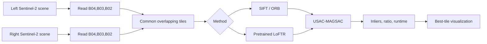
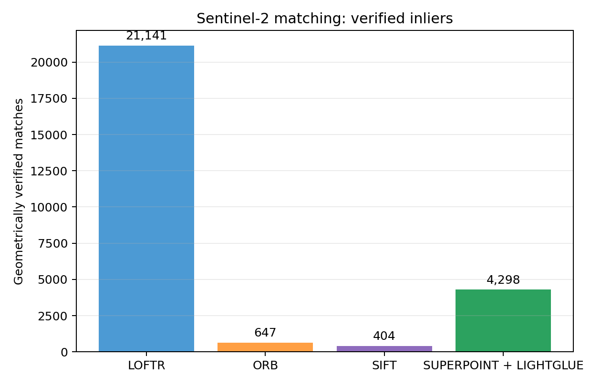
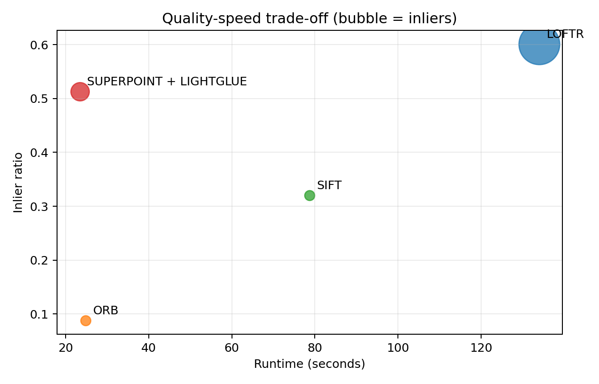
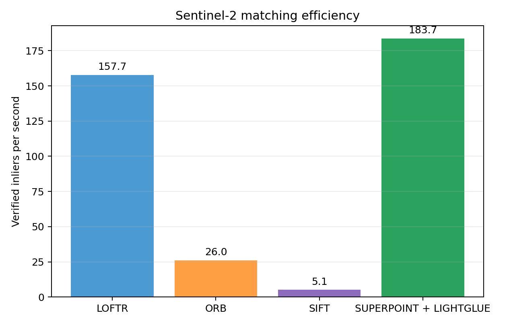
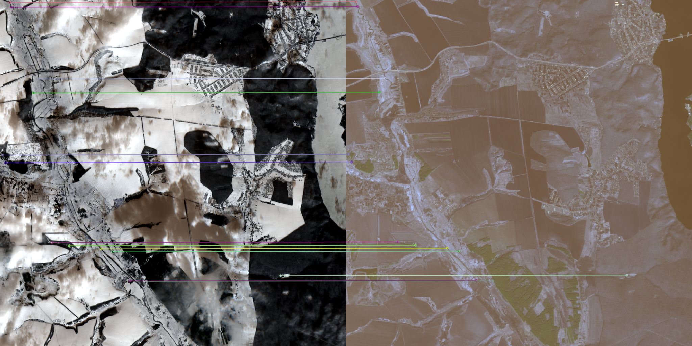
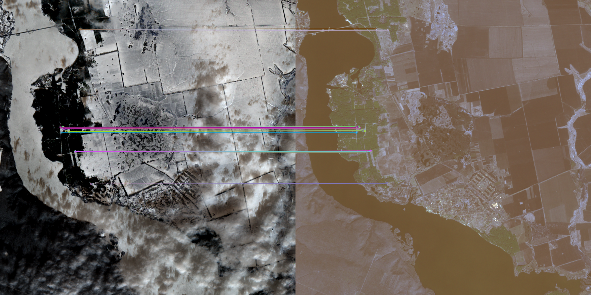
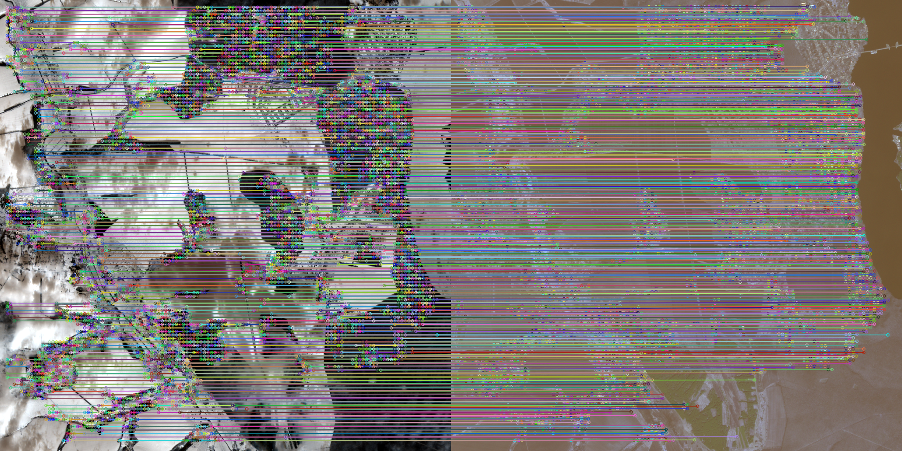
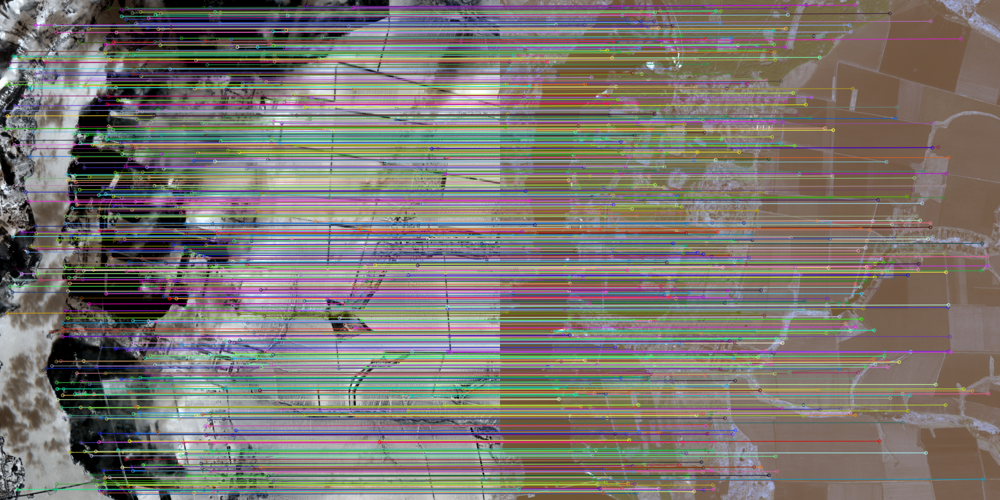

# Sentinel-2 Image Matching

This project matches local regions between Sentinel-2 observations of the same geographic area acquired at different dates or seasons. It compares two classical methods (SIFT and ORB), one deep local matcher (pretrained LoFTR), and a separate trainable Siamese scene-pair classifier.

The Kaggle archive results are included under `src/sentinel_matching/data/kaggle_benchmark/`. The benchmark below was run on one identical tiled scene pair with `B04,B03,B02`, tile size `1024`, overlap `128`, and the same geometric verification threshold. It is a fair within-pair comparison, but not yet a multi-scene generalization result.

## Task

For a pair of Sentinel-2 scenes, the system must identify corresponding image locations despite seasonal change, illumination differences, vegetation change, clouds, and land-cover change. The output is a set of local correspondences and an image visualization. A good solution has both many matches and a spatially coherent geometric transform.

The Kaggle deforestation dataset provides Sentinel-2 scenes and change masks; it does not provide ground-truth point correspondences. Therefore, same-tile/different-date scenes are weak positive pairs and geometric verification is used as an internal consistency check. Change masks must not be treated as keypoint ground truth.



## Metrics

For local matching, the primary measured quantity is:

`inlier ratio = RANSAC/MAGSAC inliers / candidate matches`

Report it together with the number of inliers and wall-clock time:

- `candidate_matches`: tentative correspondences after descriptor or model filtering;
- `inlier_matches`: correspondences supporting a single homography;
- `inlier_ratio`: geometric consistency; higher is better;
- `inference_time_seconds`: end-to-end time for all benchmark tiles; lower is better.

Without ground-truth correspondences, these values do not measure absolute localization accuracy. The next benchmark should additionally report homography reprojection error and mean ± standard deviation across independent scene pairs.

For the trainable Siamese pair classifier, use ROC-AUC, PR-AUC, precision, recall, and F1. Select its threshold on validation only; reserve the geographic test split for one final evaluation.

## Data splits and fair evaluation

The recorded SIFT/ORB/LoFTR/SuperPoint+LightGlue result is an inference benchmark, not a supervised train/validation/test experiment: all methods use the same pair, bands, tile grid, overlap, and RANSAC threshold. Its conclusion is limited to that pair.

| Experiment | Training split | Validation split | Test split | Current status |
| --- | --- | --- | --- | --- |
| Classical and learned local matching | None | Parameter-search pairs required | One held-out scene pair | One aggregate pair benchmarked |
| Siamese BCE / contrastive | Geographic tile groups | Different geographic tile groups | Unseen geographic tile groups | Deferred: current data has too few groups |

Never split tiles from the same MGRS location across Siamese train, validation, and test. This would leak geographic texture and inflate F1. The current Kaggle input contains 50 scenes but only two MGRS groups (`36UYA` and `36UXA`), so it cannot form three non-empty geographic splits. The timm Siamese experiment was therefore not completed and no Siamese score is reported. A pair-level fallback can start a technical smoke test, but its scores are not valid geographic generalization metrics. In the recorded run, the fallback manifest was created and CUDA was available, but the first EfficientNet-B0 batch spent more than three minutes reading full `.SAFE` scenes and training was stopped before a checkpoint was written.

The historical `data/kaggle_benchmark/pairs.csv` contains 80 pairs (`56` train, `12` validation, `12` test; 40 positive and 40 negative), but it is a pair-level fallback: the same tile IDs occur in every split. It is retained for benchmark traceability only and must not be used to claim geographic generalization. The manifest generator now fails by default in this situation; `--allow-pair-level-fallback` exists only for smoke tests.

## Approaches

| Approach | Type | Output | Strength | Limitation |
| --- | --- | --- | --- | --- |
| SIFT + Lowe ratio + USAC-MAGSAC | Classical | Sparse local matches | Interpretable and geometrically robust | Slow on large scenes; handcrafted descriptors |
| ORB + Hamming ratio + USAC-MAGSAC | Classical | Sparse local matches | Fastest baseline | Lower geometric precision in this experiment |
| Pretrained LoFTR + RANSAC | Deep local matcher | Detector-free correspondences | Best quality in this benchmark | Slowest method; pretrained weights required |
| Pretrained SuperPoint + LightGlue + RANSAC | Deep local matcher | Sparse learned correspondences | Best runtime and inlier throughput in this benchmark | Fewer inliers and lower ratio than LoFTR |
| timm Siamese BCE / contrastive | Trainable pair classifier | Same-area score | Can learn the project-specific pair relation | Does not return local keypoints or correspondences |

## Kaggle benchmark results

| Method | Candidates | Inliers | Inlier ratio | Time, s | Inliers/s |
| --- | ---: | ---: | ---: | ---: | ---: |
| SIFT | 1,261 | 404 | 0.320 | 78.75 | 5.1 |
| ORB | 7,352 | 647 | 0.088 | 24.84 | 26.0 |
| LoFTR | 35,163 | 21,141 | **0.601** | 134.03 | **157.7** |
| SuperPoint + LightGlue | 8,377 | 4,298 | 0.513 | **23.40** | **183.7** |



*Figure 1. LoFTR produced substantially more geometrically verified correspondences on the same tiled scene pair.*



*Figure 2. Quality-speed trade-off. Bubble area represents the inlier count.*



*Figure 3. SuperPoint + LightGlue has the highest verified-correspondence throughput.*

### Which method is best?

**LoFTR is the best quality-first method in this benchmark.** It has the highest inlier ratio (`0.601`) and the most inliers (`21,141`). Use it as the principal deep-learning result.

**SuperPoint + LightGlue is the best latency-first learned method.** It finishes in `23.40 s`, has an inlier ratio of `0.513`, and reaches the greatest verified-match throughput (`183.7` inliers/s). It is the most practical learned matcher when runtime matters.

**SIFT is the most balanced classical baseline.** Its `0.320` inlier ratio is much higher than ORB's, but it is slower and yields fewer inliers than LoFTR. It is the recommended interpretable baseline in the report.

The conclusions apply to this one scene-pair aggregate. A final claim needs several independent geographic test pairs and aggregate confidence intervals.

## Result visualizations

The images below show the strongest tiled Sentinel-2 result for each method from the recorded Kaggle benchmark. The left and right panels are the two seasonal RGB tiles; coloured segments connect correspondences retained after geometric verification. They provide a qualitative view of the aggregate metrics above.

### SIFT



*Figure 4. SIFT produces a small, geometrically consistent set of sparse correspondences across the two tiles.*

### ORB



*Figure 5. ORB is the fastest baseline and returns more tentative features, although comparatively few survive geometric verification.*

### LoFTR



*Figure 6. The pretrained LoFTR matcher provides dense, spatially distributed correspondences and the highest number of verified matches.*

### SuperPoint + LightGlue



*Figure 7. SuperPoint + LightGlue produces geometrically verified learned correspondences with a substantially lower runtime than LoFTR.*

## Repository layout

```text
src/sentinel_matching/
├── benchmark_matching.py       # tiled SIFT / ORB / LoFTR / SuperPoint + LightGlue benchmark
├── match_images.py             # classical single-pair matching and Sentinel reader
├── deep_matchers.py            # LoFTR and optional SuperPoint + LightGlue inference
├── pair_manifest.py            # geographically grouped positive/negative pairs
├── train_matcher.py            # supervised timm Siamese model training
├── evaluate_matcher.py         # held-out Siamese evaluation
├── infer_matcher.py            # checkpoint inference
├── utils/plot_benchmark.py     # regenerate CSV-based benchmark charts
├── data/                       # benchmark outputs and external-scene placeholder
└── requirements.txt            # complete pinned environment
```

## Setup

### Kaggle

Use a GPU notebook and enable Internet only if pretrained weights or the optional LightGlue package are not already attached as Kaggle inputs.

```bash
cp -r /kaggle/input/<your-code-dataset>/sentinel_matching /kaggle/working/src/
cd /kaggle/working
python -m pip install -r src/sentinel_matching/requirements.txt
```

The single requirements file pins the project-tested PyTorch/torchvision pair. If Kaggle already has this pair, pip reuses it; otherwise enable Internet or attach compatible wheels. LightGlue is pinned to an upstream commit in the same file, so the SuperPoint + LightGlue baseline additionally requires Internet or a pre-packaged Kaggle input.

### Local environment

Use Python 3.11 or 3.12 and install the one pinned environment:

```bash
python -m pip install -r src/sentinel_matching/requirements.txt
```

Dependency rationale:

| Package | Selected version policy | Reason |
| --- | --- | --- |
| `torch==2.6.0`, `torchvision==0.21.0` | Exact matched pair | Required by LoFTR and the Siamese model |
| `kornia==0.7.4` | Exact pin | Provides the `kornia.feature.LoFTR` API used by the benchmark |
| `timm==1.0.15` | Exact pin | Stable feature-extractor API for the Siamese model |
| `opencv-contrib-python-headless==4.10.0.84` | Exact pin | SIFT, ORB, USAC-MAGSAC; headless avoids GUI conflicts in Kaggle |
| `rasterio==1.4.3` | Exact pin | Sentinel JP2/TIFF reading with current Python support |
| `numpy==2.2.4` | Exact pin | Compatible numerical base for OpenCV and PyTorch tooling |
| `click`, `tqdm`, `scikit-learn`, `wandb` | Exact pins | CLI, progress, metrics, and experiment logging |

The LoFTR integration is available in Kornia and the official LightGlue repository prescribes installation from its source tree. See [Kornia/LoFTR](https://github.com/kornia/kornia) and the [LightGlue installation instructions](https://github.com/cvg/LightGlue).

## Run the benchmark

`left` and `right` can be RGB images, GeoTIFF/JP2 files, or Sentinel `.SAFE` directories. For `.SAFE`, the reader makes a composite from the selected bands.

```bash
python src/sentinel_matching/benchmark_matching.py \
  --left "/kaggle/input/deforestation-in-ukraine/<scene_a>.SAFE" \
  --right "/kaggle/input/deforestation-in-ukraine/<scene_b>.SAFE" \
  --bands B04,B03,B02 \
  --methods sift,orb,loftr,superpoint_lightglue \
  --tile-size 1024 \
  --overlap 128 \
  --ransac-threshold 3.0 \
  --device cuda \
  --output-dir /kaggle/working/matcher_outputs
```

Every method must use the same two scenes, bands, tile grid, overlap, and geometric threshold. The command writes a method-level `benchmark.csv` and a best-tile visualization into `--output-dir`.

For a faster smoke test:

```bash
python src/sentinel_matching/benchmark_matching.py \
  --left <left_scene> --right <right_scene> \
  --methods orb --tile-size 768 --overlap 96 --device auto \
  --output-dir outputs/orb_smoke
```

## Train the Siamese pair classifier

This is a separate scene-level task. Generate pairs by geographic tile so a tile never appears in more than one split:

```bash
python src/sentinel_matching/pair_manifest.py \
  --root /kaggle/input/deforestation-in-ukraine \
  --output /kaggle/working/pairs.csv \
  --max-positive-pairs-per-tile 20

python src/sentinel_matching/train_matcher.py \
  --manifest /kaggle/working/pairs.csv \
  --objective bce \
  --backbone efficientnet_b0 \
  --bands B04,B03,B02 \
  --batch-size 32 \
  --epochs 10 \
  --output /kaggle/working/matcher_bce.pt \
  --disable-wandb
```

With fewer than three geographic tiles this command intentionally stops before training. Add more tiles for a valid experiment. For a purely mechanical smoke test only, add `--allow-pair-level-fallback`; do not report its validation or test scores.

`bce` is the recommended first loss for yes/no same-tile classification. Use `contrastive` only if the learned embedding will be used for retrieval. Do not report the Siamese F1 as a local-keypoint matching metric.

The end-to-end Kaggle workflow is also available in `notebooks/siamese_matcher_tuning.ipynb`. It checks whether a geographically safe split is possible before generating the manifest or starting training.

## Recreate benchmark charts

After replacing `data/kaggle_benchmark/all_methods_metrics.csv` with a new benchmark result, regenerate the README charts:

```bash
python src/sentinel_matching/utils/plot_benchmark.py
```

## External artifacts

The current Kaggle benchmark contains CSV metrics and strongest-tile visualizations in `data/kaggle_benchmark/`. The raw `.SAFE` scenes, generated pair manifest, and any trained Siamese checkpoints are external artifacts. Download the published checkpoints and model weights from the [Google Drive artifacts folder](https://drive.google.com/drive/folders/18Q-YcFTWyKvNEILeltE9rnEuL8-dWZjq?usp=sharing), then keep their paths unchanged when reproducing the commands above.

## Task interpretation and limitations

The task is seasonal local correspondence matching between Sentinel-2 observations of the same geographic area. Large scenes are processed as overlapping tiles. The goal is a geometrically coherent correspondence set, not merely a large number of line segments.

The Kaggle deforestation dataset is primarily a change-detection dataset and does not provide exact correspondence labels. The same MGRS tile across dates is a weak positive pair; different MGRS tiles are weak negatives. Deforestation masks should not be treated as keypoint ground truth.

The principal local-matching metrics are candidate matches, RANSAC/USAC-MAGSAC inliers, inlier ratio, runtime, and homography reprojection error when ground truth is available. A Siamese pair classifier is evaluated separately with ROC-AUC, PR-AUC, precision, recall, and F1; its threshold is selected on validation only.

For a trainable Siamese classifier, `BCEWithLogitsLoss` is the recommended starting loss. Contrastive loss with margin `1.0` or triplet loss with hard-negative mining is appropriate when the output is an embedding for retrieval. A Siamese BCE model must not be presented as a local keypoint matcher: LoFTR and SuperPoint + LightGlue directly return local correspondences.

The recommended experiment order is SIFT and ORB on identical pairs, followed by LoFTR and SuperPoint + LightGlue on the same tiles, then Siamese BCE/contrastive training after enough geographic groups are available. With only two MGRS tiles, a geographically independent train/validation/test split is not reliable; more tiles or external multi-date Sentinel data are required.

The closest image-matching competition reference is Kaggle Image Matching Challenge 2022, which used learned keypoints, learned matchers, and MAGSAC-style geometric consensus. It is a methodological reference rather than a Sentinel-2 seasonal benchmark.

Large `.SAFE` scenes, generated pair manifests, and trained Siamese checkpoints are kept outside Git. The prepared benchmark archive is `upload_zips/sentinel_matching_data.zip`; upload the raw scenes and trained checkpoints separately when they are available.

## Task deliverables coverage

| Requirement from the test task | Repository artifact |
| --- | --- |
| Dataset / preparation notebook | `notebooks/image_matching_demo.ipynb` and external `.SAFE` scenes |
| Algorithm / training scripts | `benchmark_matching.py`, `train_matcher.py`, `pair_manifest.py` |
| Inference script | `inference/image_matcher_run.py` |
| Model weights | Pretrained LoFTR downloads at runtime; trained Siamese checkpoint is external when available |
| Demo with keypoints / matches | `notebooks/sentinel_script_demo.ipynb`, `notebooks/image_matching_demo.ipynb`, optional `notebooks/lightglue_benchmark.ipynb`, and `data/kaggle_benchmark/*/*_best_tile.png` |


## All output data:
[Google Drive](https://drive.google.com/drive/folders/18Q-YcFTWyKvNEILeltE9rnEuL8-dWZjq?usp=sharing)